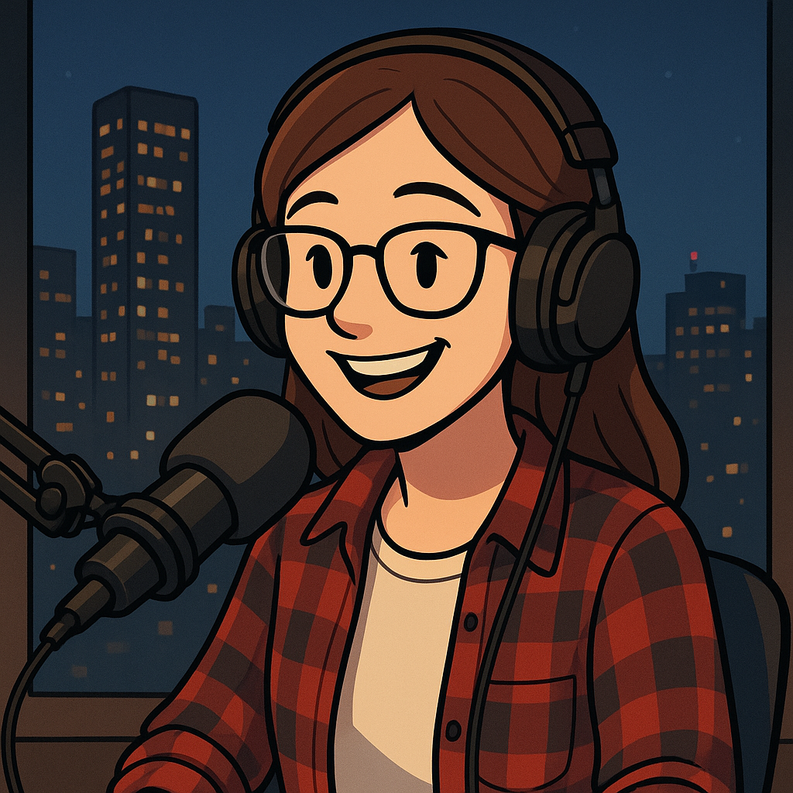

# 🤖 A Rebelião dos Bots – Podcast IA

       alt="Capa do podcast A Rebelião dos Bots" width="400px">

🎧 **Episódio 1 — “Do zero ao código”**  
Ouça o episódio completo abaixo 👇  

<audio controls>
 [Clique para ouvir o áudio do Episódio 1](output/episodio1_audio_final.mp3)
</audio>
---

## 💡 Sobre o projeto

**A Rebelião dos Bots** é um podcast criado com o apoio de **Inteligência Artificial**, com o objetivo de **ensinar tecnologia para iniciantes** de um jeito leve, divertido e acessível. 🚀  

O projeto faz parte da atividade prática do curso da **Digital Innovation One (DIO)** sobre **Geração de Conteúdo com IA**.

---

## 🧠 Episódio 1 – “Do zero ao código”

Neste episódio, falamos sobre:
- 💻 A origem da programação com **Ada Lovelace**;  
- ⚙️ O conceito de **algoritmo**;  
- 🌐 E como o **JavaScript** se tornou a linguagem mais usada do mundo.  

> “Todo dev já foi iniciante um dia — o importante é começar a digitar!”

---

## 🗂️ Estrutura do projeto

---

## 🧩 Ferramentas utilizadas

| Etapa | Ferramenta | Função |
|-------|-------------|--------|
| Roteiro | ChatGPT | Criação do roteiro com linguagem acessível |
| Voz | ElevenLabs | Geração da voz do podcast |
| Capa | IA de Imagem (Midjourney ou Leonardo AI) | Criação da arte visual |
| Edição | CapCut / Audacity | Ajustes e mixagem do áudio |

---

## 👩‍💻 Autoria
Projeto desenvolvido por **Andrielly Nascimento**  
Atividade prática da [Digital Innovation One (DIO)](https://web.dio.me).

---

## 🔗 Repositório de referência
Baseado no projeto original de **Felipe Aguiar**:  
[https://github.com/felipeAguiarCode/prompts-for-podcast-generate-by-ia](https://github.com/felipeAguiarCode/prompts-for-podcast-generate-by-ia)

---

## 🪄 Licença
Uso livre para fins educacionais.

atualização final do README com imagem e player de áudio

